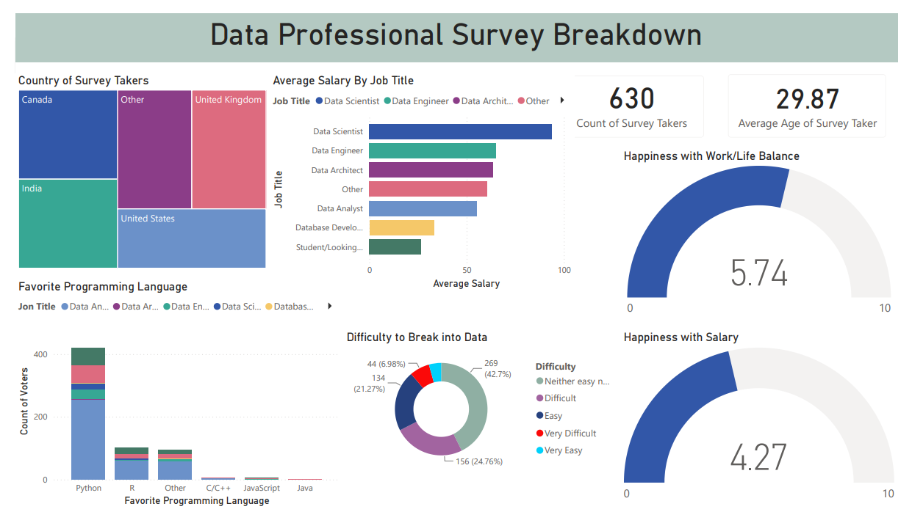

# 📊 Data Professional Survey Dashboard | Power BI

This project is an interactive Power BI dashboard built using a global survey of **630 data professionals**. It transforms raw survey data into meaningful insights, helping stakeholders understand industry trends, salary benchmarks, workforce sentiment, and career entry challenges.

---

## 📌 Project Overview

The dashboard provides a comprehensive view of the data industry, enabling analysis across:

- Salary distribution by job role
- Global workforce demographics
- Programming language preferences
- Job satisfaction and work-life balance
- Difficulty of entering the data field

---

## 📊 Key Features & Insights

### 🧹 Data Cleaning & Preparation
- Cleaned and transformed raw survey data using **Power Query**
- Handled missing values and standardized job titles
- Structured data model for efficient DAX calculations

### 💰 Salary Analysis
- Compared average salaries across roles:
  - Data Scientist  
  - Data Engineer  
  - Data Analyst  
  - Data Architect  

### 🌍 Global Demographics
- Visualized respondent distribution across countries
- Provided global insight into the data profession

### 💻 Programming Language Trends
- Identified most popular languages among professionals
- Python emerged as the dominant language, followed by R and others

### 😊 Workforce Sentiment
- Work/Life Balance Satisfaction: **5.74 / 10**
- Salary Satisfaction: **4.27 / 10**

### 🚪 Career Entry Difficulty
- Categorized responses from:
  - Very Easy → Very Difficult  
- Majority of respondents reported difficulty entering the field

### 📌 KPI Highlights
- Total Respondents: **630**
- Average Age: **29.87**

---

## 🛠️ Tools & Technologies

- Microsoft Power BI  
- Power Query (Data Cleaning & Transformation)  
- DAX (Data Analysis Expressions)  
- Data Visualization Best Practices  

---

## 📷 Dashboard Preview

---

## 📁 Files in this Repository

- `Dashboard.pbix` → Power BI project file  
- `Dataset.xlsx` → Raw dataset used for analysis  
- `Dashboard_Screenshot.png` → Dashboard preview image  

---

## 🎯 Purpose of the Project

This project demonstrates the ability to:
- Transform raw survey data into actionable insights
- Build interactive dashboards using Power BI
- Apply data visualization principles effectively
- Support decision-making in HR, recruitment, and workforce analytics

---

## 🚀 Future Improvements

- Add real-time data refresh
- Improve geographic drill-down analysis
- Add predictive salary modeling
- Integrate with SQL database for scalability

---

## 👤 Author

**Sawbhaggya Bandara**  
Undergraduate | Data Science  
SLIIT
